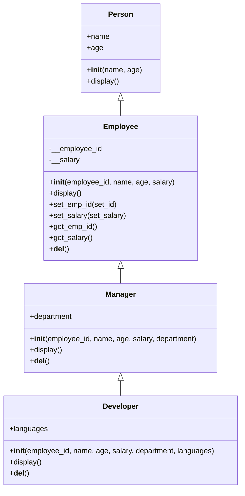
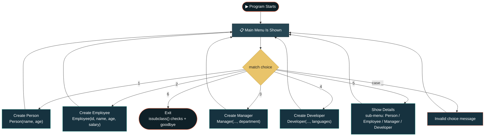

<div align="center">

```
 ██████╗  ██████╗ ██████╗
██╔═══██╗██╔═══██╗██╔══██╗
██║   ██║██║   ██║██████╔╝
██║   ██║██║   ██║██╔═══╝
╚██████╔╝╚██████╔╝██║
 ╚═════╝  ╚═════╝ ╚═╝

██╗    ██╗██████╗  █████╗ ██████╗ ██████╗ ███████╗██████╗
██║    ██║██╔══██╗██╔══██╗██╔══██╗██╔══██╗██╔════╝██╔══██╗
██║ █╗ ██║██████╔╝███████║██████╔╝██████╔╝█████╗  ██████╔╝
██║███╗██║██╔══██╗██╔══██║██╔═══╝ ██╔═══╝ ██╔══╝  ██╔══██╗
╚███╔███╔╝██║  ██║██║  ██║██║     ██║     ███████╗██║  ██║
 ╚══╝╚══╝ ╚═╝  ╚═╝╚═╝  ╚═╝╚═╝     ╚═╝     ╚══════╝╚═╝  ╚═╝
```

[+%E2%80%A2+issubclass()+%E2%80%A2+Menu-Driven+UI;Built+for+Red+%26+White+Skill+Education)](https://git.io/typing-svg)


</div>

## 🧭 Table of Contents

[Overview](#-project-overview) • [Objective](#-objective) • [Class Hierarchy](#-class-hierarchy) • [Data Storage](#-data-storage) • [Classes](#-classes-overview) • [Features](#-features) • [Flow](#-program-flow) • [Example Output](#-example-output) • [Video](#-Video) • [Skills](#-skills-demonstrated) • [Known Behaviors](#-known-behaviors--notes) • [Getting Started](#-getting-started) • [Structure](#-project-structure) • [Tech Stack](#-tech-stack) • [Author](#-author)

---

## 📌 Project Overview

**OOP Wrapper** is a menu-driven Python console program that builds an **Employee Management System** on top of a small class hierarchy: `Person → Employee → Manager → Developer`. It models real employee data and lets the user create, update, and display records while demonstrating the core pillars of Object-Oriented Programming — **inheritance, encapsulation, method overriding, and polymorphism** — using `super()` calls and `issubclass()` checks throughout.

<div align="center">

| 🧍 Person | 👔 Employee | 🧑‍💼 Manager | 👨‍💻 Developer |
|:---:|:---:|:---:|:---:|
| name, age | + ID, salary (private) | + department | + languages |

</div>

> Built for **OOP Wrapper — Red & White Skill Education.**
> *"Quality is our Motto."*

---

## 🎯 Objective

Build an Employee Management System that utilizes core OOP concepts — classes, inheritance, encapsulation, method overloading/overriding, and more — to model employee data and operations such as adding, updating, and removing employees, while tracking specialized roles like **Manager** and **Developer**.

Concepts demonstrated:

- Class hierarchy with a `Person` base class and three levels of inheritance
- **Encapsulation** of sensitive data (`salary`, `employee_id`) via private attributes and getter/setter methods
- **Method overriding** of `display()` in every derived class
- **`super()`** to call parent-class constructors and methods instead of repeating logic
- **`issubclass()`** to verify relationships between classes at runtime
- **Constructors and destructors** (`__init__` / `__del__`) to initialize and clean up each object
- A **menu-driven UI** built with Python's `match` / `case` statement

---

## 🧬 Class Hierarchy



`Employee` inherits from `Person`, `Manager` inherits from `Employee`, and `Developer` inherits from `Manager` — so a `Developer` object is simultaneously a `Manager`, an `Employee`, and a `Person`, and every `display()` call walks back up the chain with `super().display()` before adding its own details.

---

## 🗂️ Data Storage

Four **global lists** hold every record created during a session, each populated only when an object of that *exact* class (not a subclass) is instantiated — checked via `type(self) is <ClassName>`:

```python
person     = []   # Person objects only
employees  = []   # Employee objects only
managers   = []   # Manager objects only
Developers = []   # Developer objects only
```

This guard means creating a `Developer` does **not** also add an entry to `managers` or `employees`, even though a `Developer` "is a" `Manager` and `Employee` — each record lives in exactly one list.

---

## 🧩 Classes Overview

<div align="center">


</div>

| Class | Inherits From | Adds | Overrides |
|---|---|---|---|
| `Person` | — | `name`, `age` | `display()` |
| `Employee` | `Person` | private `__employee_id`, private `__salary` | `display()`, adds getters/setters, adds `__del__` |
| `Manager` | `Employee` | `department` | `display()`, adds `__del__` |
| `Developer` | `Manager` | `languages` | `display()`, adds `__del__` |

| Function | Purpose |
|---|---|
| `Show_Details(records)` | Iterates any of the four global lists and prints every key/value pair for each stored record, or a "No records found" message if the list is empty |
| `set_emp_id()` / `set_salary()` | Setter methods that validate (for ID) and update the private attributes |
| `get_emp_id()` / `get_salary()` | Getter methods that print the current private attribute values |
| `__del__()` (per class) | Prints a confirmation message identifying the record being deleted when an object is garbage-collected |

---

## ✨ Features

- Numbered **6-option main menu** that loops until the user exits
- **Create a Person:** enter name and age, then optionally display the record in a sub-menu
- **Create an Employee:** enter ID, name, age, and salary; update or display the employee ID and salary through a nested sub-menu
- **Create a Manager:** everything an `Employee` has, plus a `department`, with the same update/display sub-menu (inherited via `super()`)
- **Create a Developer:** everything a `Manager` has, plus `languages`, with the same update/display sub-menu
- **Show Details:** a dedicated sub-menu to print all stored `Person`, `Employee`, `Manager`, or `Developer` records
- **Exit Program:** prints `issubclass()` results confirming the class hierarchy (`Manager`/`Employee`, `Developer`/`Manager`, `Developer`/`Employee`) before a goodbye message
- Encapsulated `__employee_id` and `__salary` — accessible only through getter/setter methods, never directly
- Falls back to a friendly *"Enter Only ... Number"* message on any invalid menu choice

---

## 🌊 Program Flow

<details open>
<summary><b>Click to collapse / expand the flow diagram</b></summary>



</details>

| Step | Stage | Description |
|:---:|---|---|
| 1 | **Show Menu** | Print the six main-menu options |
| 2 | **Take Choice** | Read the user's number and route it with `match choice:` |
| 3 | **Create / Show** | Build the requested object (calling `super().__init__()` up the chain) or open the Show Details sub-menu |
| 4 | **Sub-menu Loop** | For created objects, offer Update / Display / Display All / Exit until the user backs out |
| 5 | **Repeat** | Loop back to Step 1 unless the user chose `6` (Exit) |

---

## 🎬 Example Output

<details open>
<summary><b>▶ Create an Employee, then a Manager</b></summary>

```
 - - - Python OOP Project: Employee Management System - - -

Choose an operation :

 1. Create a Person
 2. Create an Employee
 3. Create a Manager
 4. Create a Developer
 5. Show Details
 6. Exit

Enter your choice:  2

Enter Employee ID : 101
Enter Employee Name : Riya Shah
Enter Employee Age : 27
Enter Employee Salary : 45000

 1. Update
 2. Display
 3. Display All Details
 4. Exit

 Enter Your choice : 3

Person Name : Riya Shah
Age: 27
Emoplyee_ID : 101
Salary: $45000.0

 Enter Your choice : 4
Main Menu
```

</details>

<details open>
<summary><b>▶ Show Details & Exit (issubclass checks)</b></summary>

```
Enter your choice:  5

Choose Details to show:

 1. Personc
 2. Employee
 3. Manager
 4. Developer
 5. Exit

Enter Your Choice : 2

 Employee Details :
Employee ID : 101
Employee Name : Riya Shah
Employee Age : 27
Employee Salary : 45000.0
------------------------------

Enter Your Choice : 5
Main Menu

Enter your choice:  6
 Exit

===== Class Hierarchy Checks (issubclass) =====
Manager is a subclass of Employee   : True
Developer is a subclass of Manager  : True
Developer is a subclass of Employee : True

Thank you for using the Employee Management System. Goodbye!
Employee record [ID: 101] deleted.
```

</details>

---

## Video

Video Link :-

---

## 🎯 Skills Demonstrated

<div align="center">


-███████████-E76F51?style=flat-square)
-███████████-E76F51?style=flat-square)


</div>

- Designing a four-level class hierarchy (`Person → Employee → Manager → Developer`)
- Encapsulating sensitive attributes (`__employee_id`, `__salary`) with name-mangled private variables
- Overriding `display()` at every level while reusing parent behavior via `super().display()`
- Verifying inheritance relationships programmatically with `issubclass()`
- Using `__del__` destructors to confirm cleanup of each object type
- Guarding which global list a record belongs to with `type(self) is <ClassName>`, so only exact-type instances (not subclass instances) are logged
- Building a nested, nested-again menu system with Python's `match` / `case`

---

## 📝 Known Behaviors & Notes

A few honest notes for anyone reading or grading this code:

- **Exact-type list guard:** because each `__init__` only appends to its global list when `type(self) is <ClassName>`, creating a `Developer` never adds a row to `employees` or `managers` — even though a `Developer` inherits from both. This is intentional but worth knowing if the record counts look lower than expected.
- **`set_emp_id()` requires the current ID first:** the setter asks the user to re-confirm the *existing* ID before it will prompt for a new one — passing the wrong value prints "This is Invaild ID." instead of updating.
- **Small typo in the Show Details sub-menu:** option 1 is labeled "Personc" instead of "Person" — cosmetic only, doesn't affect behavior.
- **No input validation:** menu numbers, ages, IDs, and salaries are all cast straight through `int()` / `float()`. Non-numeric input will raise a `ValueError` and stop the program rather than showing a friendly error.
- **Destructor timing:** the `__del__` messages for `Employee`, `Manager`, and `Developer` print whenever Python's garbage collector reclaims the object (e.g., at program exit), which is why "record deleted" messages can appear after the goodbye message rather than immediately after use.

---

## 🚀 Getting Started

### Prerequisites

- Python 3.10+ (for `match` / `case` support)
- No external libraries required

### Installation

```bash
git clone https://github.com/anghanshrey/oop-wrapper.git
cd oop-wrapper
```

### Usage

```bash
python oop_wrapper.py
```

When it runs, type:
- `1` to create a Person
- `2` to create an Employee
- `3` to create a Manager
- `4` to create a Developer
- `5` to show stored details (Person / Employee / Manager / Developer)
- `6` to exit the program and view the `issubclass()` hierarchy checks

---

## 📁 Project Structure

```
oop-wrapper/
├── oop_wrapper.py   # Main script
└── README.md        # Project documentation
```

---

## 🛠️ Tech Stack

- **Language:** Python 3
- **Concepts demonstrated:** classes, multilevel inheritance, encapsulation, method overriding, `super()`, `issubclass()`, constructors & destructors, `match`/`case`, type casting

---

## 👤 Author

<div align="center">


**Shrey Anghan**
🎓 Red & White Skill Education — *Shaping skills for scaling higher...!!!*
🔗 GitHub: [@anghanshrey](https://github.com/anghanshrey)


</div>
